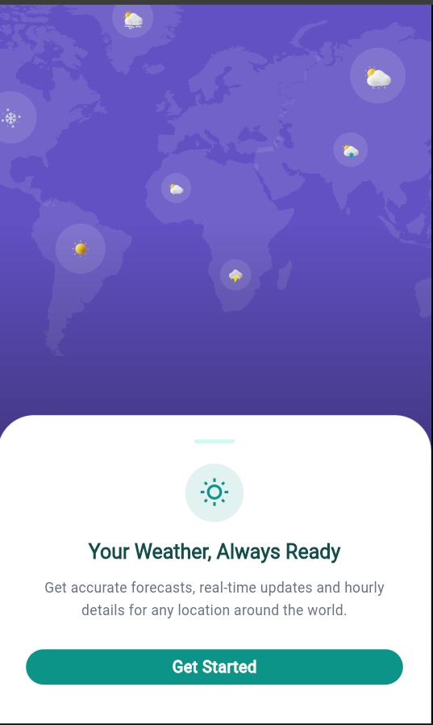
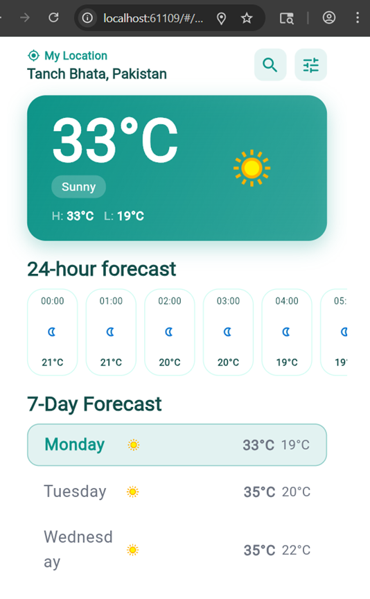
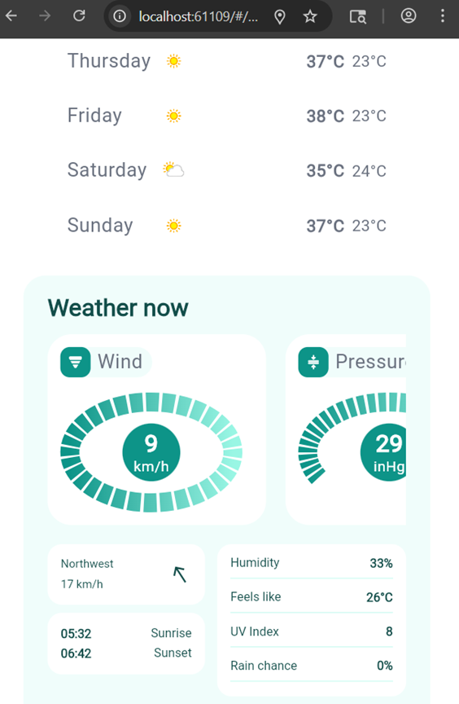
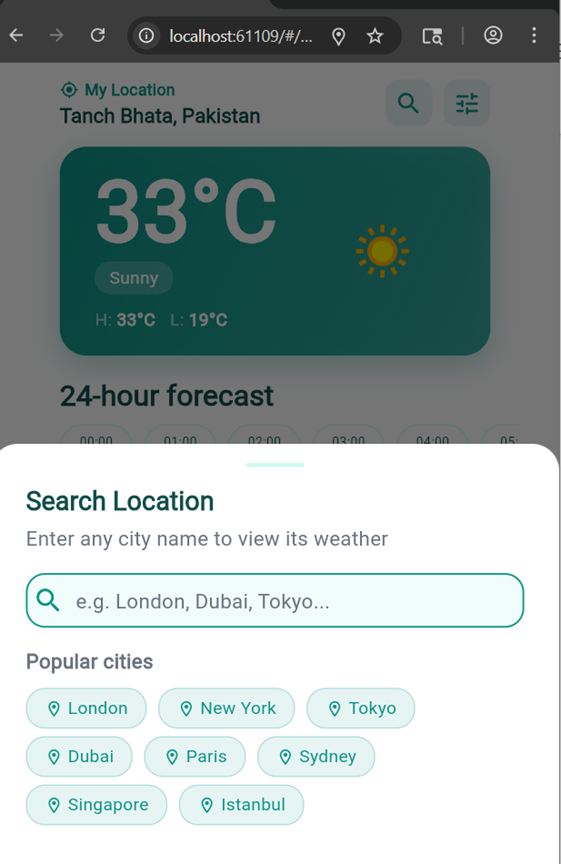
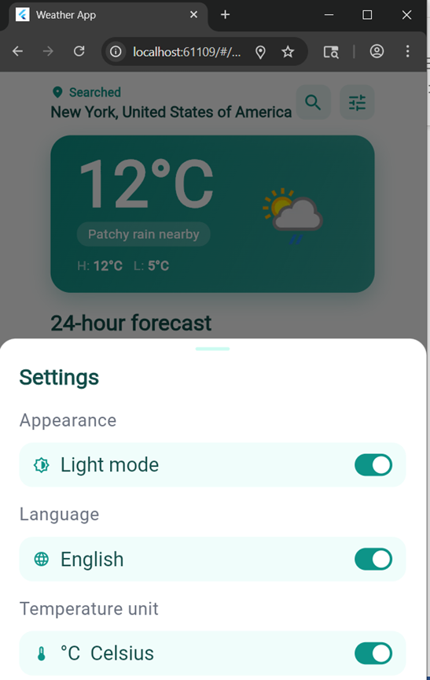
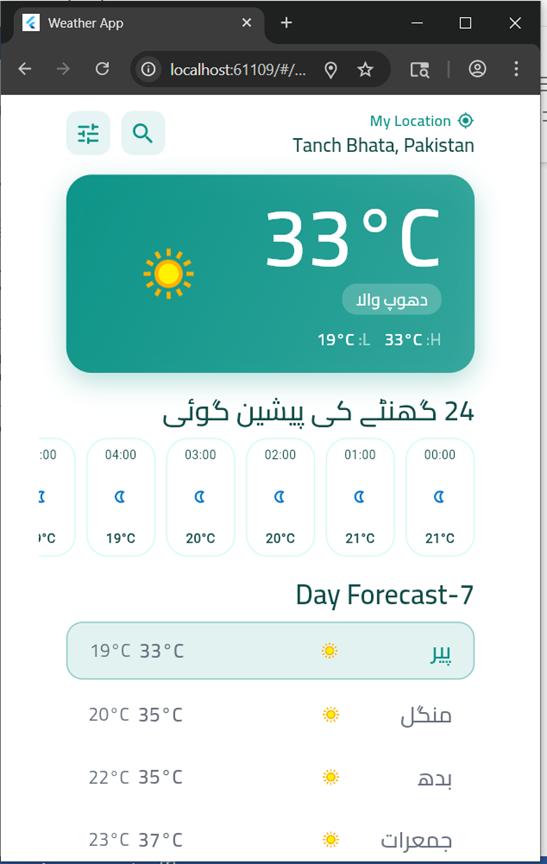
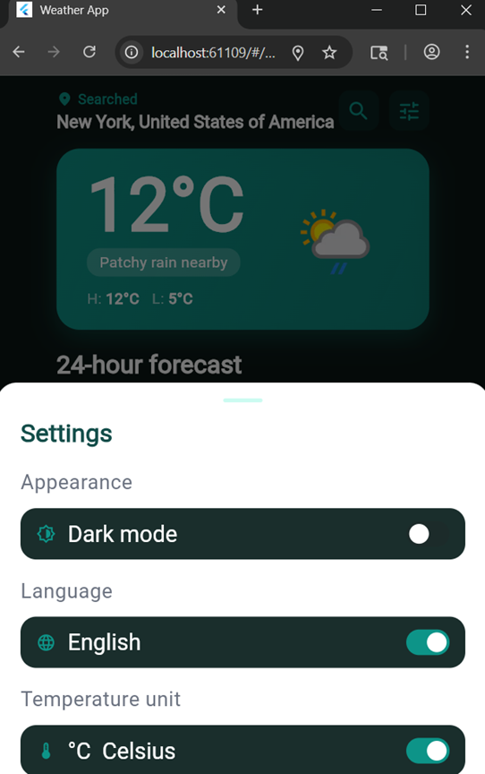

# Flutter Weather App 🌤️

A beautiful weather application built with Flutter that shows real-time weather, 7-day forecasts, hourly details, and supports both English and Urdu languages.

## Screenshots

| Welcome | Weather |
|---------|---------|
|  |  |

| 24-Hour Forecast | Location |
|-----------------|-------------|
|  |  |

| Settings | Urdu Language |
|----------|---------------|
|  |  |

| Dark Mode |
|-----------|
|  |

## Features

- 🌐 Runs on Chrome/web (original was mobile only)
- 🌍 Real-time weather for any location worldwide
- 📅 7-day forecast with tap-to-select days
- 🕐 24-hour hourly forecast
- 🌡️ Toggle between Celsius and Fahrenheit
- 💨 Toggle between km/h and mph wind speed
- 🌙 Light and Dark theme support
- 🇵🇰 English and Urdu language support (RTL)
- 🔍 Search any city worldwide
- 📍 Auto-detect current location

## Tech Stack

| Package | Purpose |
|---------|---------|
| [GetX](https://pub.dev/packages/get) | State management & navigation |
| [WeatherAPI](https://www.weatherapi.com/) | Weather data source |
| [flutter_screenutil](https://pub.dev/packages/flutter_screenutil) | Responsive UI |
| [dio](https://pub.dev/packages/dio) | HTTP networking |
| [shared_preferences](https://pub.dev/packages/shared_preferences) | Local storage |
| [flutter_animate](https://pub.dev/packages/flutter_animate) | Animations |
| [lottie](https://pub.dev/packages/lottie) | Lottie animations |
| [flutter_svg](https://pub.dev/packages/flutter_svg) | SVG assets |
| [geolocator](https://pub.dev/packages/geolocator) | Device location |
| [intl](https://pub.dev/packages/intl) | Date/time formatting |

## Getting Started

### Prerequisites
- Flutter SDK (>=3.0.0)
- A free API key from [weatherapi.com](https://www.weatherapi.com/)

### Setup

1. Clone the repo
```bash
git clone https://github.com/YOUR_USERNAME/flutter_weather_app.git
cd flutter_weather_app
```

2. Add your API key in `lib/utils/constants.dart`
```dart
static const apiKey = "YOUR_API_KEY_HERE";
```

3. Install dependencies
```bash
flutter pub get
```

4. Run the app
```bash
# Chrome
flutter run -d chrome

# Android
flutter run -d android
```

## Project Structure

```
lib/
├── main.dart
├── app/
│   ├── data/
│   │   ├── local/          # SharedPreferences
│   │   └── models/         # Data models
│   ├── modules/
│   │   ├── splash/         # Splash screen
│   │   ├── welcome/        # Welcome/onboarding screen
│   │   ├── home/           # Location detection
│   │   └── weather/        # Main weather screen
│   ├── services/           # API service layer
│   └── components/         # Shared widgets
├── config/
│   ├── theme/              # Light & dark themes
│   └── translations/       # English & Urdu strings
└── utils/                  # Constants & extensions
```

## Credits

This project is based on the original open-source work by **Abd Qader**:
🔗 https://github.com/AbdQader/flutter_weather_app

### Changes & improvements made:
- **Added full web/Chrome support** — the original project only runs on mobile; this version runs on Chrome with a mobile-width constrained layout
- Redesigned welcome/onboarding screen with animations
- Fixed pixel overflow issues across all screens for web/Chrome
- Fixed RTL overflow bugs in Urdu language mode
- Replaced SVG icons with Material icons in weather detail cards
- Fixed settings sheet overflow on wide screens
- Improved 24-hour forecast card layout
- Added mobile-width constraint for Chrome/desktop rendering
- Fixed text scaling issues on web
- Various UI refinements and bug fixes

## License

This project is for educational purposes.
Original project licensed under MIT — see [original repo](https://github.com/AbdQader/flutter_weather_app) for details.